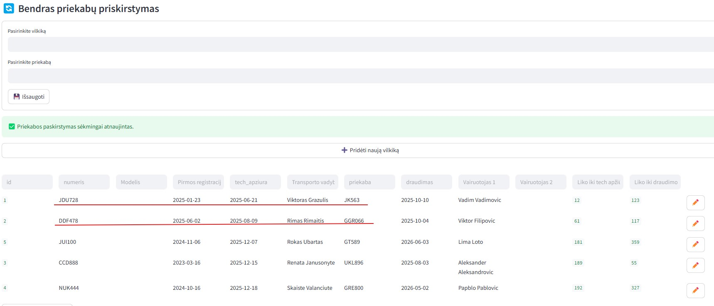

# Planning

## Aprašymas

Planing – tai centralizuota sistema, skirta efektyviam krovinių, transporto priemonių, darbuotojų ir klientų valdymui logistikos įmonėje. Sistema veikia realiu laiku, leidžia optimizuoti darbo procesus tarp skirtingų padalinių ir mažina žmogiškųjų klaidų tikimybę.

## Pagrindinis tikslas

Palengvinti ir automatizuoti visą logistikos grandinės valdymą: krovinių planavimą, transporto ir ekspedicijos grupių darbą, kreditų limitų kontrolę, darbuotojų ir klientų administravimą.

## Funkcionalumai

- **Dvi vartotojų grupės:** transporto vadybininkai ir ekspedicijos vadybininkai.
- **5 transporto ir 5 ekspedicinės grupės:** kiekviena grupė turi savo priskirtus darbuotojus, o transporto grupėms priskiriami vilkikai.
- **Regionų valdymas:** ekspedicinėms grupėms priskiriami regionai (pvz., DE14), pagal kuriuos sistema planuoja sekantį vilkiko pervežimą.
- **Darbuotojų administravimas:** pridėjimas, priskyrimas grupėms, aktyvumo statuso valdymas.
- **Klientų valdymas:** kortelės, kredito limitų (pagal VAT) priskyrimas ir automatinis likučio perskaičiavimas po kiekvieno pervežimo.
- **Krovinių valdymas:** vilkiko priskyrimas, validacijos pagal datas ir limitus, būsenos automatinis skaičiavimas.
- **Vairuotojų planavimas:** informacija apie atostogas ir kadencijos pabaigą, kad būtų paprasta planuoti keitimus.
- **Priekabų valdymas:** atskira priekabų administracija, priekabos automatiškai priskiriamos vilkikui.
- **Update modulis:** transporto vadybininkai gali realiu laiku atnaujinti vilkikų informaciją, matyti atnaujinimo laiką.
- **Planavimo modulis:** ekspedicinės grupės mato, kuriuose regionuose ir kada reikės pervežimų atvykstantiems vilkikams.
- **Kreditų kontrolė:** jei frachtas viršija kliento limitą – krovinys neįrašomas; apmokėjimo metu suma grįžta į limitą.
- **Vilkikų ir priekabų perkabinimas:** galima keisti, kurios transporto priemonės ir priekabos susietos.
- **UI niuansai:** visur išjungtas autocomplete, patogūs filtrai, mygtukai „➕“ ir „✏️“ redagavimui, moderni ir aiški sąsaja.

## Modulių aprašymas

- **Update:** transporto vadybininkų darbo langas, vilkikų pozicijų ir planuojamų atvykimų valdymas, periodinis atnaujinimo sekimas.
- **Darbuotojai:** priskyrimas grupėms, atsakomybės ir aktyvumo žymėjimas.
- **Klientai:** limitai pagal COFACE kreditavimo ataskaitas, automatinis likučio perskaičiavimas, apmokėjimų valdymas.
- **Vairuotojai:** priskyrimas vilkikams, atostogų ir kadencijų valdymas.
- **Vilkikai:** priskyrimas vadybininkams, priekabų perkabinimo funkcija.
- **Priekabos:** atskiras priekabų modulis, priskyrimas vilkikams.
- **Grupės:** ekspedicijos ir transporto grupių administravimas, regionų priskyrimas.

## Reikalavimai

- Python >=3.9
- streamlit
- pandas
- pytest

## Diegimas ir paleidimas

1. Atsisiųskite projekto failus.
2. Instaliuokite priklausomybes:
    ```
    pip install -r requirements.txt
    ```
3. Paleiskite programą:
    ```
    streamlit run main.py
    ```
4. Testų paleidimas:
    ```
    python -m pytest
    ```

## Testavimas

Testavimui naudojamas pytest. Testai tikrina ar duomenų bazėje sukuriamos reikalingos lentelės bei ar galima pridėti klientą ir vilkiką.  


## Struktūra

- `main.py` – pagrindinis failas, kuris paleidžia programą.
- `db.py` – duomenų bazės inicializacija ir lentelių kūrimas.
- `test_db.py` – automatizuotų testų failas.
- `requirements.txt` – priklausomybių sąrašas.
- `modules/` – atskiri funkcionalumo moduliai: darbuotojai, vilkikai, priekabos, grupės, klientai ir t.t.

## Ekrano nuotraukos

***Ekspedicinių grupių veikimo principas:  
Kiekviena ekspedicinė grupė turi jai priskirtus regionus(Šalies inicialai ir pirmi du regiono skaičiai), kuriuos galima koreguoti. 

Tada Planavimo modulyje pasirinkus grupę, rodo iškrovimo informaciją tik tų vilkiku, kurie išsikrauna tai grupei priskirtuose regionuose.


***Klientų kredito limito veikimo principas: 
Klientus tikrinam per draudimo bendrovę COFACE. Kiek ji, įvertinusi rizikas, kredituoja klientą. Mes papildomai šią sumą padaliname iš 3(dėl saugumo). 
Įvedus į sistemą užsakymą ant kliento, automatiškai sumažėja šio kliento kredito limito likutis. 
 
 

Kai klientas apmoka sąskaita, tai pažymima Užsakymų modulyje ir ta suma grįžta į kliento kreditingumo sumą: 
 
 

***Saugikliai: 
Įvedant užsakymą, datos negali prasilenkti(pakrovimas būti vėliau už iškrovimą. 


Neišsaugo užsakymo, kai trūksta kredito limito reikiamai įmonei. 
 
Nepriskiria vilkiko užsakymui, jeigu tuo metu vilkikas turi užduotį. 

 

***Update ir Planavimo moduliai: 
Suvedus užsakymą ir priskyrus vilkiką, užsakymai atsiranda Update modulyje, kur transporto vadybininkai arba transporto grupės, gali atsifiltruoti savo vilkikus, kur periodiškai turi: 
užpildyti SA(savaitinę vairuotojo atstovą);  
užpildyti BDL(bendro vairuotojo darbo laiko pabaigą);   
užpildyti LDL(likusį vairuotojo darbo laiką atvykus į tikslą;  
užpildyti PD ir ID(planuojamos į tikslą atvykimo datos);  
užpildyti PL ir IL(planuojamas į tikslą atvykimo laikas);  
užpildyti IST ir PST(vilkiko statusą: atvyko; pakrautas/iškrautas).  

Fiksuojamas praėjęs laikas nuo paskurinio atnaujinimo, kad informacija būtu aktuali ir nepasenusi: 


Visa ši informacija keliauja į Planavimo modulį.  
Planavimo modulyje ekspedicinės grupės mato visas paskutinias vilkikų iškrovimo vietas, atvykimo laikus ir vairuotojų darbo laikus(iš Update modulio).  
Tokiu būdu įvertina kada ir kur reikia naujo užsakymo. 

Esant dideliam vilkikų kiekiui, ekspedicinės grupės gali filtruotis ir matyti tik į jų atarnaujamus regionus atvykstančius vilkikus(pagal užpildyma modulyje Grupės)
 

***Priekabų perkabinimas 
Funkcija randasi Vilkikų modulyje. Skirta taupyti laiką ir vienu paspaudimu sukeisti vilkikų priekabas(perkabinti). 
 
 

## Ateities planai ir plėtra

**Sekimo sistemų integracija:
Integracija su GPS/sekimo sistemomis, kad pagal vilkiko realią lokaciją būtų automatiškai skaičiuojami planuojami atvykimo laikai, fiksuojamas atvykimas/išvykimas ir vairuotojo darbo režimo laikai.

**Nauji moduliai:  
Apskaitos modulis: sąskaitos, limitai, apmokėjimai, skolos; 
Išorinių vežėjų modulis.
Klientų valdymo (CRM) modulis.

**Prisijungimai ir rolės:
Vartotojų autentifikacija, skirtingos teisės (administratorius, vadybininkas ir kt.).

**Dashboard/statistikos skydelis:
Darbuotojų, krovinių, vilkikų, priekabų statistika, rodikliai, ataskaitos.

**Automatizavimo algoritmai:
Automatinis krovinių priskyrimas vilkikams pagal optimalumą.
Perkabinimo algoritmas.

**Mobilioji aplikacija:
Pagrindinės/reikalingiausios funkcijos užtikrinančios komunikacija tarp visų dalyviu ne darbo metu. 

**Kalbos: 
Anglų, Vokiečių, Ukrianiečių, Lenkų, Pranzūsų, Ispanų, Italų, Čekų, Vengrų, Bulgarų, Rumunų, Latvių. 


